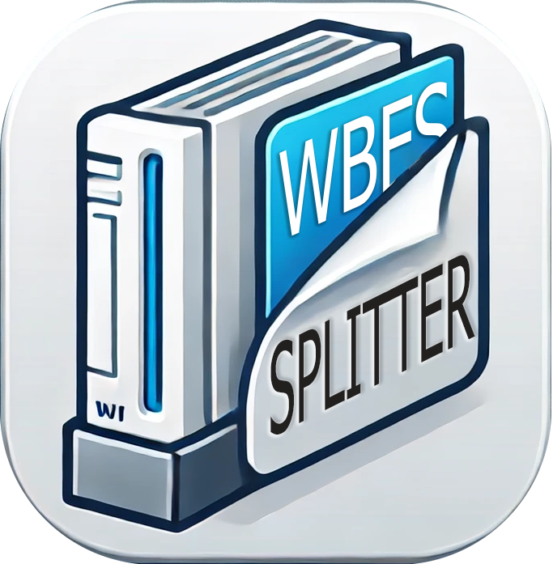

<p align="center">
  
</p>

**WBFS File Splitter**
======================
A simple and lightweight Windows application for splitting large .wbfs files into 
smaller parts, suitable for FAT32 formatted SD cards that require segmented WBFS files.

**Features**
------------
*   Drag-and-drop functionality within the app.
*   Support for dropping files directly onto the .exe file.
*   Visual progress indicator with taskbar integration.
*   Automatically validates file sizes and extensions.
*   Displays warnings for invalid files or already existing output files.
*   Easy-to-use, one-and-done interface.


**Getting Started**
-------------------

### **Downloading**
1.  Head to the [./Releases](https://github.com/JohnLouderback/WBFS-Splitter/releases) page of this repository.
2.  Download the latest .zip file for the program.
3.  Extract the contents to a directory of your choice.


**How to Use**
--------------

### **Method 1: Using the Application Interface**
1.  **Open the Program:** Double-click the WbfsFileSplitter.exe to launch the program.
2.  **Select a WBFS File:**
  *   Click the Select File button to open a file dialog.
  *   Choose a .wbfs file you want to split.
3.  **Split the File:**
  *   If the file is valid and large enough to split, the Split File button will become enabled.
  *   Click Split File to start the process.
4.  **Progress:**
  *   A progress bar will show the current operation status.
  *   Taskbar progress is also displayed.
5.  **Completion:**
  *   Once the file is split, the status will display "Done!" and a system chime will play.


### **Method 2: Drag-and-Drop Inside the Program**
1.  Open the program as described in Method 1.
2.  Drag and drop a .wbfs file onto the program window.
3.  The file will be validated, and you can split it as described above.


### **Method 3: Drag-and-Drop onto the Executable**
1. Drag a .wbfs file from your file explorer and drop it onto the WbfsFileSplitter.exe file.
2. The program will open automatically, process the file, and, if the file is valid, 
   will automatically split it.

### **Method 4: Command Line**
1. Open a command prompt in the directory containing the program.
2. Run the program with the file path as an argument:

```bash
WbfsFileSplitter.exe "C:\Path\To\File.wbfs"
```


### **Requirements**
*   A .wbfs file. The program will not process files with other extensions.
*   The .wbfs file must be larger than **4,294,967,295 bytes (4GB)** to be split.
*   The .wbfs file must be in a writable location (e.g., not on a read-only drive).


**Output Details**
------------------
*   The program splits files at a 4GB boundary (0xFFFF8000 bytes).
*   The original .wbfs file will be renamed with a .tmp extension during the process and then replaced upon completion.
*   A second file with the .wbf1 extension will be created, containing the remaining data.


### Example:
Input File:Xenoblade Chronicles.wbfs (8.5GB)
Output Files:
*   Xenoblade Chronicles.wbfs (4GB)
*   Xenoblade Chronicles.wbf1 (4.5GB)


**Error Handling**
------------------

The program provides warnings and error messages for the following scenarios:

*   The selected file does not exist.

*   The selected file is not a .wbfs file.

*   The file has already been split (e.g., the .wbf1 file already exists).

*   Errors during file operations (e.g., read/write errors).


For critical errors, a system error sound will play.


**Known Limitations**
---------------------

1.  The program does not support batch processing of multiple files simultaneously.

2.  Only works on Windows (no Linux or macOS support).


**Contributing**
----------------

If you'd like to contribute to this project:

1. Fork the repository.

2. Create a branch for your feature or bug fix: git checkout -b feature-name.

3. Submit a pull request with a detailed explanation of your changes.

Please note that this code was written "quick and dirty". You will be disappointed if 
you came here looking for a peak example of object-oriented programming.


**License**
-----------

This project is licensed under the MIT License. See the LICENSE file for details. 
Please feel free to share this program with others, but do not sell it or claim it as your own.

**Credits**
-----------

Created by John Louderback to simplify .wbfs file splitting for use with FAT32 SD 
cards and USB drives without needing to rely on an online tool.
